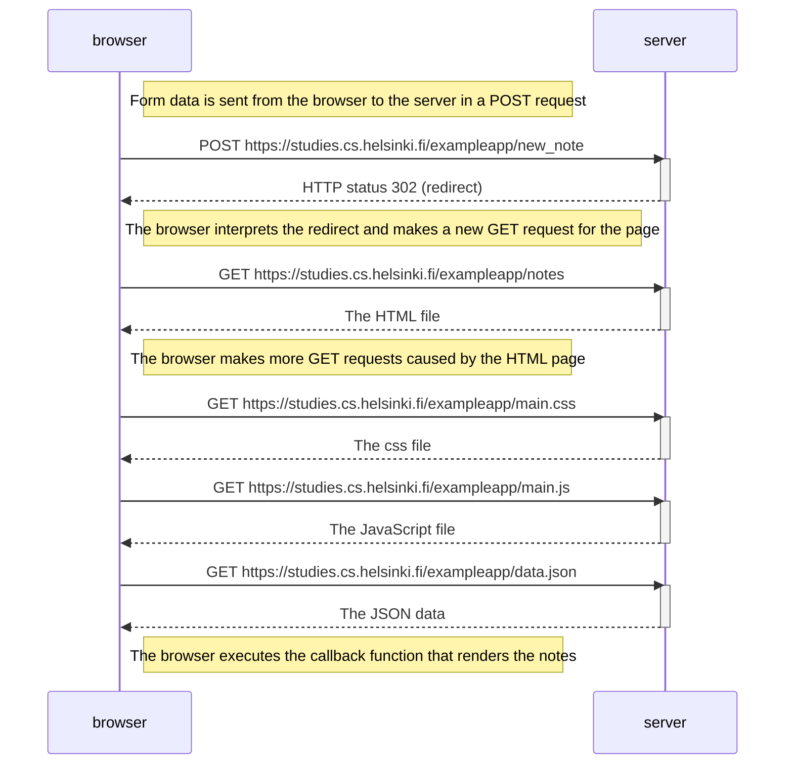

```mermaid
    sequenceDiagram
    participant browser
    participant server
    
    Note right of browser: Form data is sent from the browser to the server in a POST request

    browser->>server: POST https://studies.cs.helsinki.fi/exampleapp/new_note
    activate server
    server-->>browser: HTTP status 302 (redirect)
    deactivate server
    
    Note right of browser: The browser interprets the redirect and makes a new GET request for the page

    browser->>server: GET https://studies.cs.helsinki.fi/exampleapp/notes
    activate server
    server-->>browser: The HTML file
    deactivate server
    
    Note right of browser: The browser makes more GET requests caused by the HTML page

    browser->>server: GET https://studies.cs.helsinki.fi/exampleapp/main.css
    activate server
    server-->>browser: The css file
    deactivate server
    
    browser->>server: GET https://studies.cs.helsinki.fi/exampleapp/main.js
    activate server
    server-->>browser: The JavaScript file
    deactivate server    

    browser->>server: GET https://studies.cs.helsinki.fi/exampleapp/data.json
    activate server
    server-->>browser: The JSON data
    deactivate server
    
    Note right of browser: The browser executes the callback function that renders the notes
```