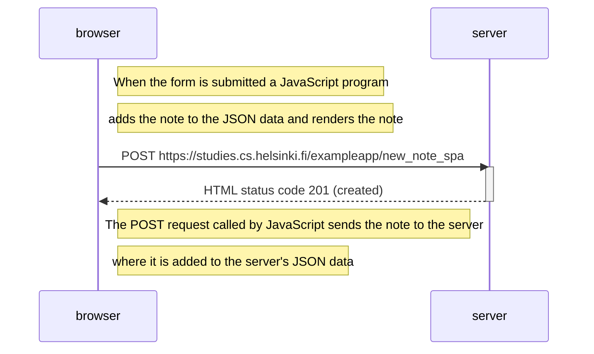

```mermaid
    sequenceDiagram
    participant browser
    participant server
    
    Note right of browser: When the form is submitted a JavaScript program 
    Note right of browser: adds the note to the JSON data and renders the note

    browser->>server: POST https://studies.cs.helsinki.fi/exampleapp/new_note_spa
    activate server
    server-->>browser: HTML status code 201 (created)
    deactivate server

    Note right of browser: The POST request called by JavaScript sends the note to the server 
    Note right of browser: where it is added to the server's JSON data
```